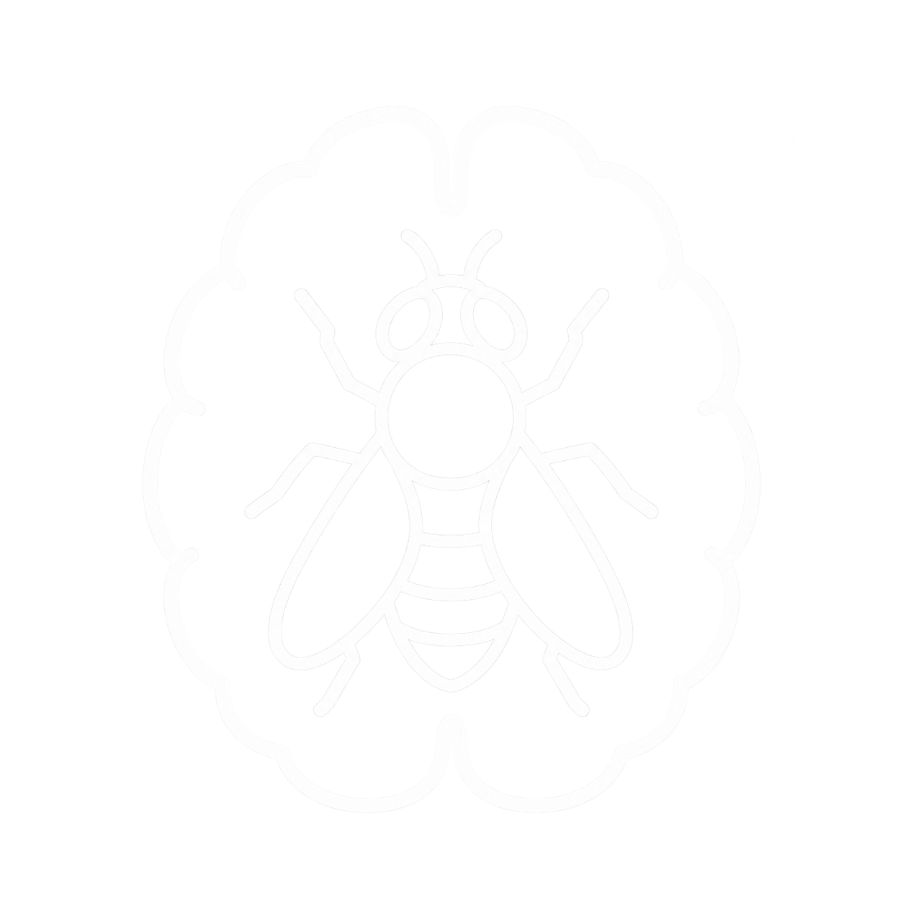

<p align="center">
  
</p>

<h1 align="center">MindFly</h1>

<p align="center">Use your EEG to control a simulated fruit fly.</p>

<p align="center">
  <a href="https://mindextend.com/mindfly">Open MindFly</a> ·
  <a href="#try-it">Getting started</a> ·
  <a href="#run-locally">Local development</a>
</p>

MindFly is an interactive browser simulation inspired by
[“Two Brain Pathways Initiate Distinct Forward Walking Programs in Drosophila”](https://doi.org/10.1016/j.neuron.2020.07.032).
It combines EEG from a Muse 2 headset, neural anatomy from the
[MaleCNS connectome](https://male-cns.janelia.org/download/), and a simplified
model of a fly walking circuit. Connect a headset to explore the EEG interaction,
or try the demo without one.

## Try it

Open **[mindextend.com/mindfly](https://mindextend.com/mindfly)**.

**Without a headset:** select **Try demo**. Generated waveforms and a changing
focus score drive the same neural simulation and walking controls as live EEG.
Select **Exit demo** to stop.

**With a Muse 2:** use Chrome on a Bluetooth-enabled computer.

1. Turn on the headset and close other apps connected to it.
2. Select **Connect Muse 2**, choose your device, and fit the headset securely.
3. Stay still while calibration completes, then relax while focusing.

The four EEG traces show TP9, AF7, AF8 and TP10. Dots beside the labels indicate
estimated contact quality: green, yellow or red. If contact is poor, adjust the
headset; use **Recalibrate** to collect a new baseline.

Moving from localhost to the live site requires reconnecting and recalibrating.
Remote hosting must use HTTPS for Bluetooth access.

## How it works

1. **Read EEG.** Muse 2 supplies four channels at 256 samples per second.
   A Rust/WebAssembly module processes the signal and estimates a focus score
   relative to the user's calibration.
2. **Stimulate the model.** A usable score of at least **65%** enables simulated
   stimulation at **10 Hz**: one 5 ms input pulse every 100 ms.
3. **Move the fly.** Modeled neural activity drives forward walking. The neuron
   overlays brighten with simulated activity, while software controls the fly's
   position and leg animation.

Lower focus, unusable or disconnected EEG, and background-tab suspension stop
walking. Each stimulation bout lasts at most 30 seconds of model time; lowering
focus below the threshold allows another bout.

Alpha activity around 10 Hz contributes to the EEG analysis. The fly's 10 Hz
stimulation is a separately generated input switched on by the focus score;
MindFly does not transmit the raw EEG waveform to the modeled neurons.

## What is modeled

The circuit contains **54 neurons, 266 directed connections and 24 candidate
Bolt protocerebral neurons (BPNs)**. Twenty-five aligned overlays show their anatomy.
The surrounding gray brain and ventral nerve cord provide visual context.

MaleCNS supplies recorded anatomical data. Neural firing, walking speed, wall
avoidance and leg animation are modeled; muscles and sensory feedback are not
simulated.

The candidate BPN mapping and firing patterns have not been validated against
the study. The focus score is experimental feedback, not a validated attention
test. The human brain image is an AI-generated illustration, not a scan.

See the [circuit reconstruction notes](docs/BPN_RECONSTRUCTION.md),
[visualization provenance](docs/neural-visualization.md), and the app's
**How it works** panel for details.

## Run locally

Requires **Node.js 22.13 or newer** and npm.

```sh
git clone https://github.com/MindExtendAI/mindfly.git
cd mindfly
npm ci
npm run dev
```

Open the localhost URL printed by the development server. The two compiled WASM
modules are included, so Rust is not needed to run the app.

### Build and check

```sh
npm test
npx tsc --noEmit
npm run build
```

The standalone build writes `dist-standalone/` with `/mindfly/` as its asset base.
Use `npm start` to preview the build locally.

To change the neural engine, follow the
[Rust build instructions](rust/neural-engine/README.md), rebuild its WASM binary,
and rerun the checks. The proprietary EEG binary is included; its source is not part of this project.

Tests cover reference simulation traces, stopping, walking, anatomical coordinates,
EEG processing and WASM failures. They check software consistency, not biological
accuracy. Physical Muse connection and calibration require separate hardware testing.

## Code and privacy

| Component | Implementation |
| --- | --- |
| Interface, anatomy and fly rendering | React, TypeScript and Three.js |
| Neural simulation | [Rust/WASM](rust/neural-engine/) |
| EEG filtering, calibration and focus calculation | Proprietary Rust/WASM module |
| Headset connection | Web Bluetooth through `muse-js` |

Rust/WASM is the only neural simulation engine; there is no JavaScript fallback.
If a required module fails, control stops and the app reports an error.

A hosting site can supply an optional analytics module with
`VITE_ANALYTICS_MODULE_URL`. It is omitted by default. The hosted MindFly site
uses Google Analytics for website visits; EEG and focus data are not sent.

**Raw EEG stays in browser memory.** Calibration parameters are stored locally
for each device. The EEG source is private; this repository includes only its
[adapter](lib/eeg-wasm.ts) and compiled binary.

## Sources and licensing

- **Walking study:** [Bidaye et al., 2020](https://doi.org/10.1016/j.neuron.2020.07.032).
- **Neural anatomy:** [MaleCNS](https://male-cns.janelia.org/download/), a collaboration
  between HHMI Janelia, the University of Cambridge, MRC Laboratory of Molecular
  Biology and Google Research; distributed under CC BY 4.0.
- **Fly body and animation:** NeuroMechFly/Flygym assets and Xenova adaptations,
  with Apache-2.0 and MIT notices. The body is female; the neural reconstruction is male.
- **Human brain illustration:** [generation provenance](docs/human-brain-image.md).

A project-wide source license has not yet been added. Bundled components retain
their individual terms; the [EEG binary is proprietary](public/licenses/EEG-BINARY-NOTICE.txt).
See the [attribution file](public/ATTRIBUTION.txt) and [license notices](public/licenses/).
